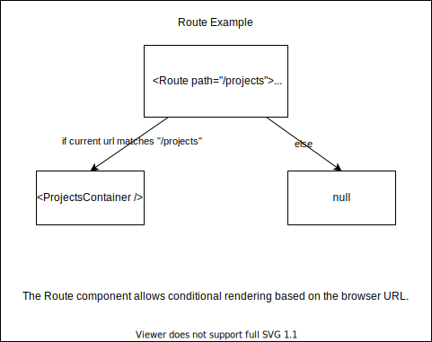

---
presentation:
  width: 1500
  height: 1000
  controls: false
---

<!-- slide -->

<h1> Client Side Routing 📲 </h1>

<!-- slide -->

<h2><strong> ✅ Objectives </strong></h2>

- Create a multi-page SPA
- Utilize the most common react-router components to build a SPA: BrowserRouter, Route, Switch, Link, and NavLink
- Use custom hooks like useHistory and useParams to access the state of the router
- Use the history object to navigate pages
- Create dynamic routes and use params

<!-- slide style="text-align: left;" -->

<h2 style="text-align: center;"><strong>💡 What is client side routing and React router?</strong></h2>

<br>

<details>
  <summary>
    Reveal ⬇️
  </summary>
  <hr/>

  Conditional client side rendering based on the browser URL.

  <hr/>

</details>
<br/>


"Client side routing is a type of routing where as the user navigates around the application or website no full page reloads take place, even when the page’s URL changes. Instead, JavaScript is used to update the URL and fetch and display new content" - Will Taylor

"React Router is a fully-featured client and server-side routing library for React... React Router runs anywhere React runs; on the web, on the server with node.js, and on React Native."
[React Router Docs](https://reactrouter.com/docs/en/v6/getting-started/tutorial)

<!-- slide -->

#### Install and setup react router

- React Router has been updated to V6 but V5 is used in the curriculum.

- To install V5 run this command: `npm install react-router-dom@5.3.3` otherwise, V6 will install by default

- Within `index.js`, wrap the `App` component in the `BrowserRouter` component that will be imported from the `react-router-dom` library

- Check out this post if you're curious about [what's new in v6](https://enlear.academy/whats-new-in-react-router-6-e34e451e5285)

<!-- slide style="text-align: left;" -->

<h2 style="text-align: center;"><strong> 🗒️ Planning Routes </strong></h2>

<br>

Before we do anything, we need to make a plan about what we want.

What URLs do we want our application to have to simulate the feeling of different "pages"?

<br>

| Component       | Url                |
| --------------- | ------------------ |
| Home            | / (root route)     |
| About           | /about             |
| ProjectForm     | /projects/new      |
| ProjectEditForm | /projects/:id/edit |
| ProjectDetail   | /projects/:id      |
| ProjectList     | /projects          |

<!-- slide style="text-align: left;" -->

<h2 style="text-align: center;"><strong> The Primary React Router Components </strong></h2>

- BrowserRouter

- Switch

- Route

- Link

- NavLink

<br>

<!-- slide style="text-align: left;" -->

<h2 style="text-align: center;"><strong> 1️⃣ BrowserRouter </strong></h2>

💡 `BrowserRouter` is a wrapper for App to allow conditional rendering based on the URL

❓ Where does it belong?

- Since `App` component is imported and mounted inside the `Index.js` file, this is a great place to wrap the component within `BrowserRouter`

<br>

```js
import React from "react";
import ReactDOM from "react-dom";
import { BrowserRouter as Router } from "react-router-dom";
import "./index.css";

import App from "./App";

ReactDOM.render(
  <React.StrictMode>
    <Router>
      <App />
    </Router>
  </React.StrictMode>,
  document.getElementById("root")
);
```

<!-- slide style="text-align: left;" -->

<h2 style="text-align: center;"><strong> 2️⃣ Switch Component </strong></h2>

💡 `Switch` is a wrapper for Routes. Looks through all its child components and renders only the first one

❓ Where does it belong?

- Consider where most of the applications components are rendered, this is where they will be nested inside the `Switch` component. Typically this is in the `App` component. Sometimes an extra component will be created designated for just routing.

```js
return (
  <div className={isDarkMode ? "App" : "App light"}>
    <Header isDarkMode={isDarkMode} onToggleDarkMode={onToggleDarkMode} />
    <Switch>
      <Home />
      <About />
      <ProjectsContainer />
    </Switch>
  </div>
);
```

<!-- slide style="text-align: left;" -->

<h2 style="text-align: center;"><strong> 3️⃣ Creating routes using the Route Component </strong></h2>

💡 `Route` wraps content that should be visible when the designated route is active (when the current url matches its path).

❓ Where does it belong?

- Every component nested inside of the `Switch` component will be individually wrapped inside of a `Route` component.

💥 Route will be provided a `path` prop, indicating when its children should be visible. 

<!-- slide -->



<!-- slide -->

```js
return (
  <div className={isDarkMode ? "App" : "App light"}>
    <Header isDarkMode={isDarkMode} onToggleDarkMode={onToggleDarkMode} />
    <Switch>
      <Route exact path="/">
        <Home />
      </Route>
      <Route path="/about">
        <About />
      </Route>
      <Route path="/projects">
        <ProjectsContainer />
      </Route>
    </Switch>
  </div>
);
```

<!-- slide style="text-align: left;" -->

<h2 style="text-align: center;"><strong>4️⃣ Link Component </strong></h2>

<br>

💡 `Link` creates an anchor tag in your application that will navigate using React Router instead of the browser default

We want to use `Link` for navigation in our application. It will ensure that a page reload does not occur, unlike the use of an anchor tag `<a></a>`

💥 Link will be provided a `to` prop which indicates where the link should navigate to (generates the href)

<!-- slide style="text-align: left;" -->

<h2 style="text-align: center;"><strong> Replace the anchor tags in the Header Component </strong></h2>

<br>

```js
return (
  <header>
    <nav>
      <Link to="/" style={{ borderBottom: "none" }}>
        <h1 className="branding">
          <span className="logo">{"//"}</span>
          Project Showcase
        </h1>
      </Link>
      <div className="navigation">
        <Link className="button" to="/projects">
          All Projects
        </Link>
        <Link className="button" to="/projects/new">
          Add Project
        </Link>
        <button onClick={onToggleDarkMode}>{buttonTextContent}</button>
      </div>
    </nav>
  </header>
);
```
<!-- slide style="text-align: left;" -->

<h2 style="text-align: center;"><strong>5️⃣ Using Navlink </strong></h2>

<br>

💡 `NavLink` is the same as Link with the additional feature that an "active" class will be added when the url matches the value of the 'to' prop

We want to use `Link` for navigation in our application. It will ensure that a page reload does not occur, unlike the use of an anchor tag `<a></a>`

💥 Link will be provided a `to` prop which indicates where the link should navigate to (generates the href)

<!-- slide style="text-align: left;" -->

